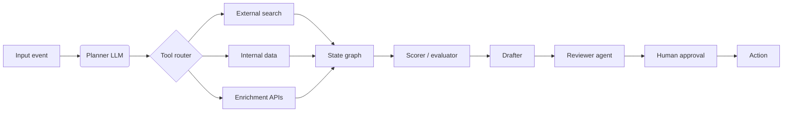
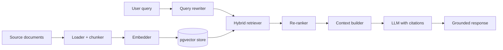

<!--
  Profile README for ankitmishra01 (special "username" repo — root README renders on profile)
  Target roles: AI Strategy · AI Operations · Head of AI Operations · AI Enablement · Fractional CAIO
  Editorial rules applied:
    - Current employer listed in Current Appointments only — no proprietary IP exposed
    - Prior client outcomes generalised (no specific revenue, conversion, or margin figures)
    - Prior employer client lists generalised (e.g., banks "across X countries" not named institutions)
-->

<h1 align="center">Ankit Mishra</h1>

<b>AI Strategy · Operations · Enablement · Responsible AI Deployment</b>

  <a href="https://ankitmishra.ca">ankitmishra.ca</a> ·
  <a href="https://www.linkedin.com/in/ankitmishra01/">LinkedIn</a> ·
  <a href="https://www.forbes.com/sites/ankitmishra/">Forbes</a> ·
  <a href="mailto:ankit@ankitmishra.ca">ankit@ankitmishra.ca</a>

---

## About

I'm an AI-native commercial leader with 13+ years designing global revenue systems and scaling AI adoption across regulated and emerging-market contexts. As a Fractional Chief AI Officer through my consulting practice, I partner with C-suite teams across climate, fintech, and logistics to integrate AI into commercial infrastructure, operations, and go-to-market strategy.

My focus is the operating layer where AI becomes durable enterprise capability — strategy, fluency programs, governance, and the commercial outcomes that justify the investment. I publish on AI governance for Forbes (200k+ readers) and contribute to interdisciplinary research on AI trust at the University of Toronto's Schwartz Reisman Institute alongside researchers from Harvard, BCG, Meta, Mila, and the Government of Ontario.

---

## Live Projects

Working tools you can open and use right now:

**[AI Trajectory Index](https://ai-trajectory-index.vercel.app/)** — *"Who is winning the AI race — and who is being left behind?"* A live ranking of **186 economies** on AI readiness and adoption trajectory through 2028. Five pillars: infrastructure, talent, governance, investment, economic strength. Independent research contribution alongside the Schwartz Reisman Institute appointment.

**[India Household Economy Dashboard](https://india-household-economy-dashboard.vercel.app/)** — *"India's household economy, made explorable."* Interactive maps and charts across **22 indicators** from government surveys (HCES, PLFS, NFHS-5, Census), covering 14 years of state and union-territory level data. MIT-licensed; sources traceable to government data, not modelling.

---

## AI Capabilities

### Strategy, Operations & Enablement

- **AI transformation roadmaps** — opportunity sizing, vendor evaluation, build-vs-buy, sequencing, change management for organisations adopting AI at scale
- **AI enablement programs** — frameworks that move teams from AI-curious to AI-native through hands-on training, vendor selection, governance setup, and quarterly outcome reviews
- **Fractional CAIO** — integrating AI into commercial infrastructure, operations, and GTM strategy across climate, fintech, and logistics
- **Cross-cultural & emerging-market deployment** — built data governance frameworks adopted across financial services in Nigeria, Kenya, Ghana, Uganda, and Zambia in prior commercial leadership roles

### LLM Orchestration & Architecture (in production)

| Capability | Tools used in production |
|---|---|
| Agent orchestration | LangGraph, Anthropic API (Claude, Claude Code) |
| No-code & hybrid workflow automation | Gumloop, Zapier, Shortcut AI |
| Retrieval & data | Supabase (Postgres + pgvector), Apps Script for ingestion |
| Observability & cost telemetry | Helicone |
| Frontend & serving | Vercel, Cursor, Docker |
| Languages | Python, TypeScript, SQL, R |

Active learning: PyTorch · Hugging Face · vLLM · Ollama · Qdrant — extending the engineering surface beneath the API layer.

### Governance & Frameworks

- **EU AI Act**, **NIST AI RMF**, **OECD AI Principles** — applied to vendor evaluation and deployment decisions
- **Responsible AI deployment** — accuracy, bias, downstream risk oversight built into enablement curricula
- **Enterprise security & data governance** — Postgres RLS, domain-restricted OAuth, serverless API proxies, audit-logged data pipelines
- **AI & Trust Working Group**, Schwartz Reisman Institute, U of Toronto — interdisciplinary research on AI governance and institutional trust

---

## Selected Engagements

### Public consulting practice (AM Consulting Group)

Fractional CAIO and growth advisory across climate, fintech, and logistics:

| Client | Sector | Engagement type |
|---|---|---|
| **Cycle Capital** | Climate / cleantech innovation | Multi-year operating-plan management for a cleantech innovation hub |
| **Astreas** | Logistics | Fractional CAIO + growth advisory for first-year commercial scaling |
| **Sensitel** | Industrial IoT | AI-augmented growth experiments and lead-funnel optimisation |
| **Tomo Credit** | Fintech | Outbound marketing and conversion optimisation |
| **CleanAI Initiative** | Climate tech | Responsible AI deployment advisory for climate-tech founders |

---

## AI Architecture Patterns I Work With

Two reference architectures I've designed and adapted across engagements. Diagrams are generic patterns — actual implementations adapt to client constraints, regulatory context, and existing infrastructure.

### Agentic workflow pattern (with human-in-the-loop)

### Retrieval-augmented intelligence pattern

---

## Selected Writing

A slice from 50+ Forbes pieces (200k+ readers) plus prior bylines in Energy Post, NextBillion, Renewable Energy World, TechCrunch, and Institute for Research on Public Policy.

### AI & Technology

- *[Decarbonizing The Industrial Sector: Can AI Catalyze Global Progress?](https://www.forbes.com/sites/ankitmishra/)* — Forbes, Aug 2025
- *[Could Data Centre Demand Spark A Climate Tech Rebound?](https://www.forbes.com/sites/ankitmishra/)* — Forbes, Apr 2025
- *[Dynamhex Launches An Energy Data API Platform To Accelerate Climate Action](https://www.forbes.com/sites/ankitmishra/)* — Forbes, Dec 2020
- *[Data Science: The Key Tool Cities Need To Reduce Carbon Emissions](https://www.forbes.com/sites/ankitmishra/)* — Forbes, Jul 2020

### Climate, Energy & Transition

- *[Building Greener Cities: Climatetech's Role In GHG Reduction](https://www.forbes.com/sites/ankitmishra/)* — Forbes, Oct 2023
- *[3 Key Measures To Advance 2030 Climate Change Goals In The United States](https://www.forbes.com/sites/ankitmishra/)* — Forbes, Aug 2023
- *[Increasing ZEVs Adoption Will Be Critical In Decarbonising Canada's Transportation Sector](https://www.forbes.com/sites/ankitmishra/)* — Forbes, Jul 2023
- *[Green Skills Can Enable Workers To Transition And Forge Careers In Canada](https://www.forbes.com/sites/ankitmishra/)* — Forbes, Apr 2023
- *[Will the Paris Climate Change Deal Prove To Be The Catalyst for Cleantech?](https://techcrunch.com/)* — TechCrunch, Jan 2016

### Public Policy & Cities

- *[Four steps to relieving the Canadian housing crisis](https://policyoptions.irpp.org/)* — Institute for Research on Public Policy, May 2023
- *[Could Tech Transform Public Transit Use To Lower Congestion In Canada?](https://www.forbes.com/sites/ankitmishra/)* — Forbes, Apr 2025
- *[What Lessons Can Toronto Learn To Accelerate Subway Construction?](https://www.forbes.com/sites/ankitmishra/)* — Forbes, Jan 2025
- *[3 Key Measures U.S. Cities Can Adopt To Advance Net-Zero Initiatives](https://www.forbes.com/sites/ankitmishra/)* — Forbes, Feb 2024

### Emerging Markets (India, Africa)

- *[How India Can Adopt Innovative Tech To Cut Industrial GHG Emissions](https://www.forbes.com/sites/ankitmishra/)* — Forbes, Sep 2024
- *[Husk Power: Solar Energy Is Key To Replacing Diesel And Advancing Sustainable Growth In Africa](https://www.forbes.com/sites/ankitmishra/)* — Forbes, Jun 2022
- *[Investors and Entrepreneurs in Africa Take Note: Price of Solar's Dropping While Demand's Increasing](https://nextbillion.net/)* — NextBillion, May 2017
- *[Clearing the Way for Clean Energy Investments in Emerging Markets](https://nextbillion.net/)* — NextBillion, Jul 2017

### Media appearances

Ticker News · CBC Radio · CBC Weekend Radio · Financial Post · TechCrunch · Policy Options · Energy Post · Renewable Energy World

---

## Conference Presentations

- *Industry Insight: Climatetech and Sustainability in Canada* — McGill University, Oct 2024
- *Net Zero Solutions for All* — Toronto Metropolitan University, Jun 2024 (with Dr. Sara Hastings-Simon, Bob Inglis, Sharene Shafie)
- *The Energy Sector Unlike You've Ever Seen Before* — Global Energy Show Canada, Jun 2024 (with Kelly Parker, Nathan Ripley)
- *Carbon Markets & Circular Economy* — Concordia University, Feb 2024 (with Jason Taylor, Alan Young, Alison Cabana-Wong)

---

## Independent Research

- **AI Trajectory Index** — a live tool scoring 186 economies on AI readiness and adoption trajectory. Independent research contribution alongside the Schwartz Reisman Institute appointment.
- **OECD Economic Survey of India 2014** — provided research and economic analysis for the manufacturing chapter (Nov 2014)
- **IEA, *Modernising Building Energy Codes to Secure our Global Energy Future*** — data analysis on energy-efficiency targets of IEA and OECD member countries (Aug 2013)
- **Economic models** (public GitHub): SME Financial Stress & Credit Demand Tracker (Bank of Canada / Statistics Canada composite index), CFIB Business Barometer dashboard, Energy–Macro–Policy Pulse (UK & Europe)

---

## Current appointments

- **Commercial Portfolio Director & AI Transformation Lead**, Holocene (Toronto)
- **Founder & Principal Consultant**, AM Consulting Group — fractional CAIO and growth advisory
- **Member, AI & Trust Working Group**, Schwartz Reisman Institute, University of Toronto
- **Entrepreneur-in-Residence**, Ivey Business School, Western University — New Venture Project
- **Mentor**, TechAccel Program, McGill University — Dobson Centre for Entrepreneurship

## Selected prior experience

- **Head of Growth, Founding Team** — Pngme (financial data platform, 5 African markets)
- **Head of Growth, Founding Team** — Alariss Global (sales talent marketplace, 11 countries)
- **Senior Associate, Sales Operations & Strategy** — Nauto (AI-enabled driver safety)
- **Senior Analyst** — Premise Data (socioeconomic data platform, 140+ countries)
- **Economist** — Ontario Ministry of Energy
- **Consultant** — OECD, IEA, NATO Parliamentary Assembly (Paris / Brussels)

## Education

- **EMBA**, Ivey Business School, Western University (2026)
- **MA, International Economic Policy**, Sciences Po Paris (2013) — Energy & Intelligence Studies
- **BA Hons, Mathematics**, York University (2011) — Book Prize for highest major GPA

---

## Open to

AI Strategy · AI Operations · **Head of AI Operations** · **AI Enablement Lead** · AI Transformation Lead · Director of AI · Fractional CAIO · AI Program Management · Responsible AI / Governance leadership.

Toronto, Canada · Canadian Citizen · TN Status · O-1A Visa Eligible · Open to remote and US relocation.
